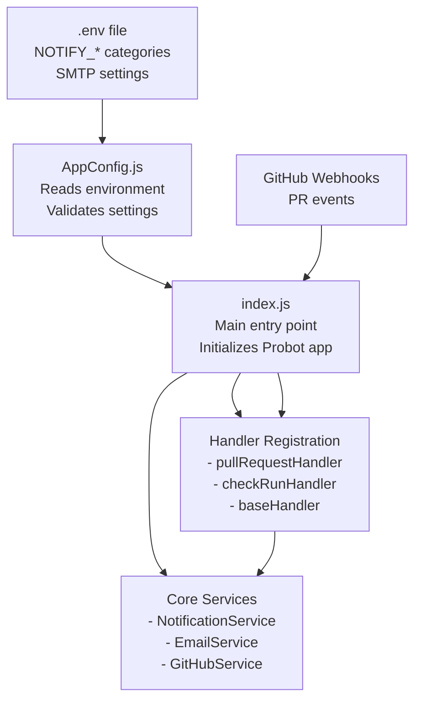

# PR Notification App - Architecture Overview

## 1000-Foot View System Architecture

This simple diagram shows the main flow and relationships in the PR notification app, focusing on initialization and handler loading.

## Key Architecture Components

### **Configuration Flow**
1. **`.env`** → Contains 5 simple `NOTIFY_*` categories and SMTP settings
2. **`AppConfig.js`** → Reads and validates environment variables
3. **`index.js`** → Uses config to initialize services and handlers

### **Initialization Sequence**
1. **`index.js`** starts the Probot application
2. **Services** are created (NotificationService, EmailService, GitHubService)
3. **Event handlers** are registered for GitHub webhooks:
   - `pullRequestHandler` - Handles PR lifecycle events
   - `checkRunHandler` - Handles CI/CD completions
   - Both extend `baseHandler` for common functionality

### **Event Processing Flow**
1. **GitHub** sends webhook to app
2. **Handler** processes event (determines if notification needed)
3. **NotificationService** orchestrates the notification
4. **GitHubService** gets PR owner details and additional recipients  
5. **EmailService** sends notifications via SMTP
6. **Logger** writes audit trail to `logs/audit.log`

### **Key Relationships**
- **AppConfig** ← reads from → **.env file**
- **index.js** → initializes → **Services & Handlers**
- **Handlers** → delegate to → **NotificationService**
- **NotificationService** → uses → **EmailService + GitHubService**
- **All components** → log to → **Logger (audit trail)**

## Why This Architecture?

### **Simple & Focused**
- Clear entry point (`index.js`) 
- Logical separation between configuration, services, and handlers
- PR owner always gets priority in notification flow

### **Easy to Understand**
- Configuration flows from `.env` → `AppConfig` → services
- Event handling follows predictable pattern: webhook → handler → service → delivery
- Audit logging provides complete visibility

### **Maintainable**  
- Each handler focuses on one event type
- Services have single responsibilities
- No complex priority systems or configuration options

This simplified architecture makes it easy to:
- Add new PR event types (create new handler)
- Change notification logic (modify services)  
- Debug issues (check audit.log)
- Configure for different environments (update .env)